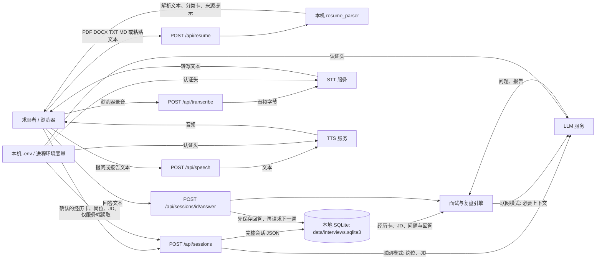

# InterviewDrill 开发日志

本文件统一记录各开发日的交付、困难、Bug、处理办法、业务核对及验收结果。自 D04 起只追加本文件，不再建立每日独立记录。D01—D03 的历史记录与问题台账已合并；历史时点的“未验证”保持原意，后续结论以更新日期为准。

[第 1 天](#d01) · [第 2 天](#d02) · [第 3 天](#d03) · [第 4 天](#d04) · [第 5 天与集中验收](#d05) · [问题台账](#issues)

<a id="d01"></a>

## D01：原型基线

日期：2026-10-03。对应[逐日开发计划](../开发日计划.md) D01 / E01。基线为当前本地简易版，不代表已满足多人 SaaS 的权限、任务恢复或真实语音质量要求。

### 范围与边界

- 后端为 FastAPI，前端为 `static/` 中的本地页面；会话以 SQLite 存于 `data/`，已有本地数据不会用于烟测。
- 当前支持简历解析与证据卡、岗位/JD 配置、规则或模型面试、轮流录音入口、复盘、历史、Markdown 导出。模型、语音 API 的真实性能不由本次无密钥基线证明。
- 仓库排除 `.env`、`data/`、`output/`、`.playwright-cli/`、虚拟环境和 Python 缓存。无密钥烟测只复制源代码到临时目录，不复制已有简历、会话或密钥。
- 当前 API 未建立用户身份与资源归属；在 E04/E05 完成前仅按本地单用户用途运行，不开放共享部署。

### 今日验收

| 检查 | 命令/方法 | 结果 |
| --- | --- | --- |
| 现有单元测试 | `python -m unittest discover -s tests -v` | 30 项通过 |
| 仓库隐私边界 | `python scripts/baseline_check.py` 检查忽略规则及已跟踪文件 | 通过 |
| 干净环境启动 | 同上，隔离临时目录启动 Uvicorn，清除供应商密钥环境变量 | 通过 |
| 首页 | `GET /` 返回 HTML | 通过；本日没有做视觉回归截图 |
| 核心闭环 | 无密钥配置、合成简历解析、规则面试开场/答题/结束、复盘、导出、删除 | 全部通过 |
| 真实模型与语音 | 未调用真实供应商、未使用麦克风 | 未验证；列入 D04 与 D30/D35 |

重跑方式：在项目根目录执行 `python -m unittest discover -s tests -v` 和 `python scripts/baseline_check.py`。后者只输出检查结果，不输出简历正文、会话 ID、密钥或响应内容。脚本使用临时 SQLite 数据库，完成后删除。

### 下一步

D02 明确首版数据流与范围；D04 在预算和可用密钥具备时单独验证百炼北京地域的 LLM/STT/TTS。当前规则闭环成功不能被记录为真实 AI 面试成功。

<a id="d02"></a>

## D02：数据流与首版范围

日期：2026-10-03。对应[逐日开发计划](../开发日计划.md) D02 / M0。此图描述**当前代码的实际行为**；后文“首版范围”是[企业级实施方案](../企业级实施方案.md)的目标，尚未实现的能力不能从当前图中推断出来。

### 当前数据流



规则演示模式不调用 LLM；它只能验证流程，不能提供真实 AI 深挖。无云端 STT 时，前端可尝试浏览器 `SpeechRecognition`，实现与数据处理取决于浏览器；无云端 TTS 时使用系统语音。图中的 STT/TTS 箭头只适用于配置对应服务的情况。当前 `assistant` 是面试官，`user` 是求职者；简历里的第一人称属于求职者。

| 数据 | 进入系统与使用方式 | 当前留存 / 离开边界 |
| --- | --- | --- |
| 简历原件 | 前端将文件 Base64 放入 `POST /api/resume`；本机解析 PDF/DOCX/TXT/MD | 原件不写入会话数据库；请求和前端内存中短暂存在。解析后的全文与卡片返回浏览器。下载、浏览器缓存及服务商无关边界不由此保证 |
| 经历卡、岗位、JD | 用户在浏览器核对卡片后，以 JSON 提交 `/api/sessions`；规则或模型据此生成问题 | 会话整体写入本地 SQLite。联网模式中岗位/JD 用于岗位分析，经历卡/JD 会用于问题与复盘生成；当前每轮生成仍携带完整卡片分类 |
| 答案与问题 | `/answer` 先把求职者回答写入 SQLite，再生成下一题；`/report` 读取整场对话 | 问答与报告存于会话 JSON，可在历史页读取或导出。联网模式把相关对话发给 LLM；具体供应商侧留存须按其条款核查 |
| 录音与转写 | 浏览器 `MediaRecorder` 录音；`/api/transcribe` 把音频交给已配置的 STT；浏览器识别则绕开该 API | 云端录音可在当前页面下载/重试；当前服务端不把音频写入 SQLite，转写文本在提交答案后入库。浏览器刷新会失去未提交录音 |
| 朗读文本与音频 | 浏览器将问题或复盘摘要传给 `/api/speech`，服务端向 TTS 请求音频；否则使用系统朗读 | 合成音频返回浏览器播放，当前不写入会话库；TTS 服务会收到待朗读文本 |
| 密钥与配置 | `app.py` 启动时读取项目 `.env`，环境变量优先；`ai_provider.py` 组装服务端认证头 | `/api/config` 仅返回配置状态及缺失字段名，不返回密钥。密钥随服务端请求进入指定供应商；不应写入前端或仓库 |
| 导出与删除 | `/export` 从 SQLite 生成 Markdown/JSON 交浏览器下载；`DELETE /sessions/{id}` 删除该行 | 用户已下载的文件、浏览器保存的内容和供应商侧留存不随本地删除而消失；当前没有跨服务删除工作流 |

### 信任边界与当前缺口

1. 浏览器到本地 FastAPI：目前有 `Origin` / `Sec-Fetch-Site` 跨站限制，但**没有登录、用户归属或资源授权**。知道会话 ID 的同一服务使用者可以访问对应会话。共享部署的入口必须等 E04/E05 完成。
2. 本地服务到供应商：LLM/STT/TTS 通过 `ai_provider.py` 的 URL 与密钥调用。页面显示“已配置”只验证字段齐全，不代表接口、地域、余额、语音格式或实际质量可用。真实联调归 D04。
3. 本地持久化：SQLite 当前将整场会话作为一个 JSON 保存，没有用户 ID、历史分页或独立消息表。M1 的 E03/E05/E06 负责结构化存储和迁移；现有本机数据库不能自动分配给新注册用户。
4. 请求中的外部调用：当前答题先保存，再同步等待模型；报告也同步生成。网络断开、重启和重复调用的端到端恢复仍需 M2 的持久任务、幂等与 Outbox。
5. 浏览器到用户设备：音频下载和 Markdown/JSON 导出会离开应用控制；未来用户删除只保证应用受控存储按规则处理，不承诺撤销已下载副本。

### 首版范围与非目标

按照实施方案第 1、3、9 节，目标首版为**邀请制多用户 SaaS**。用户已在 D02 确认按此范围推进；具体用户量、部署地区和数据留存承诺留待 M0 退出评审确定。M1 前继续只供本机单用户使用。

| 首版必须交付 | 验收方向 |
| --- | --- |
| 登录、资源归属、导出/删除授权 | 两名用户不能互读、互改、互导出、互删资料；任务与文件同样受控 |
| 简历版本、来源证据卡、任意岗位/JD 与映射 | 保留原文来源和确认状态；项目、实习、学历、技能可区分，岗位不限三个模板 |
| 可靠的文字面试、暂停/结束、刷新恢复 | 已确认答案先持久化；重复提交不重复落库，过时生成不污染已结束会话 |
| 轮流语音录制、转写确认、提问/总结朗读 | 权限拒绝、格式失败、识别失败有清晰状态和文字退路；不宣称实时打断 |
| 证据可追溯的复盘、重答、导出与删除 | 每条反馈对应回答与岗位要求；无证据时说明未考察或证据不足 |
| 用量、任务、故障及最小运营能力 | 可解释单场成本和失败；运营页面默认不浏览用户正文；恢复演练可重复 |

| 本轮 60 开发日不交付 | 再考虑的条件 |
| --- | --- |
| 实时双工语音、自动接话、自然打断 | 轮流语音实测后确认价值，另定延迟、打断和成本指标 |
| OCR、长资料 RAG / 向量检索 | 扫描简历或长资料成为主要输入，且检索有可测收益 |
| 组织/导师协作、企业 SSO、私有部署 | 出现明确客户、角色矩阵与交付环境 |
| 支付、套餐、自动招聘筛选和录用决策 | 成本、需求、人工监督与单独验收明确后另立项目 |

### D02 验收记录

代码对照：`app.py` 的解析、会话、答题、报告、导出与语音接口；`resume_parser.py` 的文件提取；`engine.py` 的规则/联网分支与角色约束；`ai_provider.py` 的供应商调用；`static/app.js` 的浏览器录音与临时状态。上述数据流和边界均可追溯到这些入口。

- [x] 六类数据（简历、JD、答案、音频、密钥、供应商）的来源、处理和去向已画出，并与当前代码对照。
- [x] 当前能力、首版必须交付和非目标已分开；已记录不得共享部署的阻断边界。
- [x] PyCharm 项目配置目录已排除 Git，并纳入基线检查。
- [x] 本地自动化回归与隔离环境烟测通过，结果如下。
- [x] 用户确认邀请制多用户 SaaS 范围，以及账号隔离、文字面试、轮流语音的实施顺序。
- [ ] 部署地区、用户量和数据留存承诺在 M0 退出评审确定；本日未擅自设定。

| 验收项 | 执行方式 | D02 结果 |
| --- | --- | --- |
| 现有回归 | `python -m unittest discover -s tests -v` | 30 项通过 |
| 无密钥完整规则流程 | `python scripts/baseline_check.py` | 干净环境启动、首页、解析、规则面试、复盘、导出、删除全部通过 |
| PyCharm 配置排除 | `git check-ignore -v .idea/workspace.xml` | 命中 `.gitignore` 中的 `.idea/` 规则 |
| 问题处理 | 对照[开发问题记录](#issues) | 本日文档与 Git 忽略问题已解决；身份授权和真实服务联调仍按阶段计划推进 |

本日没有真实 API 请求或浏览器麦克风测试。上述通过项只验证当前原型未因 D02 改动而退化；不代表首版 SaaS 功能已经实现。

<a id="d03"></a>

## D03：评测样本与业务验收

日期：2026-10-03。对应[逐日开发计划](../开发日计划.md) D03 / M0。工作目录为英文路径 `interview-drill`；旧中文目录保留备份，未在本日改动。

### 本日交付

- 建立[评测样本规范](../evals/README.md)与 `schema_version=1` 的[合成开发集](../evals/seeds.json)。7 条虚构案例覆盖 AI/软件工程、产品管理、数据分析、客户服务和设计，岗位不限于最初的三个技术方向。
- 新增 `python scripts/validate_evals.py`：核对来源声明、授权引用、脱敏标志、JD/简历/回答的连续原文引用、卡片类型、审核状态、重复 ID、分组拆分和明显个人信息模式。它是入库前的结构门禁，不能代替人工脱敏与授权核验。
- 定义 5 项人工标注口径与 0–2 分含义；目前 7 条均为 `pending`，不存在已审核金标。冻结集和真实模型质量比较仍按 D34 推进。
- 新增 6 项评测数据测试，其中一项将 7 条案例逐条通过现有会话、回答、结束和复盘接口，检查面试官/求职者角色和引用链。

### 业务细节核对

| 业务约束 | 核对方式 | 结果 |
| --- | --- | --- |
| 任意岗位 + JD，不锁死三种技术岗位 | 7 条案例包含 5 个岗位族；逐条以 `role`、`jd` 创建规则面试 | 7/7 创建成功，岗位名保留 |
| 简历与 JD 是面试依据 | 校验 `jd_quote` 与 `resume_quote` 均为原文连续片段，经历卡 ID 可回查 | 7/7 通过；伪造片段被拒绝 |
| AI 扮演面试官，用户扮演求职者 | 检查开场问题、消息角色顺序和面试官问题守卫 | 7/7 为 `assistant` 提问、`user` 回答 |
| 求职者回答可复盘 | 每个案例提交回答、结束并生成规则报告；报告引用回查回答 | 7/7 通过，规则报告分数均为 `null` |
| 样本来源与人工标签可信 | 检查 `source`、`review`；伪造授权、待审核伪装成人工标签、重复 ID 和跨集组被拒 | 7/7 明确为自编、待审核的开发集案例 |

规则模式只证明业务流程与数据契约没有退化，不能证明联网 AI 会准确追问或给出有价值的反馈。本日未使用真实简历、真实候选人录音或供应商 API，也未得出模型质量分数。

### 验收命令

| 命令 | 结果 |
| --- | --- |
| `python scripts/validate_evals.py` | 7 条有效；5 个岗位族；7 条 `dev`；7 条 `pending` |
| `python -m unittest discover -s tests -v` | 36 项通过 |
| `python scripts/baseline_check.py` | 干净环境启动、解析、规则面试、报告、导出、删除通过 |

### 困难、Bug 与处理

1. **真实样本授权缺口**：当前没有可直接公开入库的真实简历及人工标签。首批以自编虚构案例启动格式和流程验收；把真实样本、至少 100 条人工审核和冻结集明确留在 D34，避免虚报模型质量。
2. **重复 JSON 字段覆盖**：标准 `json.loads` 默认接纳对象内重复键，可能掩盖来源或引用字段。载入器加入重复键拦截，测试确认拒绝。
3. **证据链漂移与角色混淆**：案例可能引用 JD、简历或回答中不存在的文字，也可能把求职者经历写成面试官发言。校验器验证三类引用，测试检查每条问题能通过面试官守卫及接口消息顺序。
4. **Windows 命令行编码**：初次校验输出的中文岗位族在当前控制台显示乱码。命令行改为 ASCII 转义 JSON；源文件仍为 UTF-8，解析后仍是中文。

未解决边界：模式化邮箱/手机号/密钥扫描不能识别所有可重识别信息；真实授权必须人工核查。D04 的入口是这套开发集已入库且现有无密钥回归通过；下一步按预算上限分别验证百炼 LLM/STT/TTS 的北京地域配置，记录成功或可复现失败、延迟与用量，不保存密钥。

<a id="d04"></a>

## D04：百炼真实服务联调

日期：2026-10-04。对应 M0 / D04。目标是核对北京地域配置、真实连接、数值用量和失败分类，不把一次连接成功当成整场面试质量验收。

### 实现与运行方式

- 新增 `scripts/provider_check.py`。默认离线预检；指定 `--live` 后才使用本机配置，依次调用 LLM、TTS、STT。复用应用中的 `engine.model_text`、`synthesize` 和 `transcribe_audio`，未另写一套请求协议。
- 预检限制百炼北京官方 HTTPS 地址及本日核价的三个模型，支持旧域名和北京业务空间专属域名；缺密钥、地域/路径错误、模型超出核价范围时不发送任何请求。
- 固定虚构材料、LLM 输出上限 128 tokens、固定短句、识别音频不超过 30 秒；每项最多一个模型请求，不自动重试。TTS 另下载一次结果音频，下载请求不携带 API Key。TTS 失败时 STT 明确记为阻断，不能假装已测。
- `--budget-cny 0.05` 为本次预估预算门禁；按固定载荷及公开单价预留约 0.0122128 元。它不是云账户的硬扣费上限，也不约束应用正常面试。需更换模型、改变材料或再次运行时，重新核对单价和额度。
- 为适配器增加可选的用量观察回调，只接收状态码及白名单中的非负数值。未知用量记为 `null`，错误不输出供应商响应正文、密钥或音频签名。
- 将 `.env` 读取抽成共享函数；诊断脚本无需导入 `app.py`，因此不会为检查配置而初始化用户数据库。环境变量优先级及 BOM 兼容保持不变。
- 合并原 D01、D02、D03 和开发问题记录到本文件；每日独立文件已移除，历史内容保留在上述章节。

```powershell
# 只检查配置，不调用供应商
python scripts/provider_check.py
# 最多三次模型请求，会产生少量用量
python scripts/provider_check.py --live --budget-cny 0.05
```

默认机器结果为 `output/provider-check.json`，已被 Git 忽略。它仅供本地重跑核对；正式人工阅读记录只维护本文件。

### 真实服务验收

实测开始于 2026-10-04 14:32:08（北京时间），三项请求均为北京默认域名，模型调用各一次，无重试。音频和问答正文只在内存处理，未使用真实简历、用户历史会话或麦克风。

| 服务 | 模型 | 结果 | 客户端耗时 | 供应商返回用量 |
| --- | --- | --- | --- | --- |
| 文本模型 | `qwen-plus` | HTTP 200；JSON 中面试官身份、可提问形式与测试/评估关键词检查通过 | 2324 ms | 输入 105、输出 48、合计 153 tokens |
| 语音合成 | `qwen3-tts-flash` | HTTP 200；下载并解析 WAV，非空且非全零 | 1592 ms（含下载与合并） | `characters=24` |
| 语音识别 | `qwen3-asr-flash` | HTTP 200；去除标点/空白后的转写与合成原句完全一致 | 958 ms | 输入 68、输出 15、合计 83 tokens；`seconds=2` |

WAV 为 24 kHz、单声道、16-bit PCM，实际时长 2.72 秒。供应商的 `seconds=2` 与 WAV 时长存在粒度差异，两者不能混用。本次按返回用量及核对单价折算约 **0.00254 元**；实际扣费保持未知，需以供应商账单为准，不能从免费额度或本地时长推定。

### 业务细节与失败核对

| 核对项 | 方法和结果 | 实际边界 |
| --- | --- | --- |
| 求职者/面试官身份 | 虚构测试工程师经历 + JD + 求职者回答输入 LLM，输出必须 `speaker=interviewer` 并通过角色守卫 | 仅一次提问及主题关键词检查，不证明多轮深挖质量 |
| 语音链路有内容 | TTS WAV 校验、STT 识别、规范化文本一致 | 未测真人口音、噪声、WebM/OGG、浏览器麦克风及播放设备 |
| 原业务未退化 | 原测试包含简历四分类、任意岗位、角色纠错、报告引用和七个种子案例的接口流程；干净环境烟测通过 | 本日整场业务回归使用规则或替身，真实多轮面试与复盘需后续实测 |
| 失败可定位 | 替身测试覆盖 400、401、403、429、500、超时、网络错误、响应校验失败、TTS 失败导致 STT 阻断 | 这些故障是注入测试，本次真实账户未发生鉴权/限流故障 |
| 未知成本不伪报为零 | 没有用量/请求超时/校验失败时总成本记未知；HTTP 200 后校验失败仍保留已返回用量 | 不承诺失败无费用，不自动重试付费请求 |
| 默认命令不扣费 | 默认预检、无效预算、缺密钥和非北京地址均测试为零网络请求 | `--live` 才主动请求；每次重跑都需计入用量 |

验收命令：`python -m unittest discover -s tests -q` **44 项通过**（新增 8 项）；`python scripts/baseline_check.py` 的首页、解析、规则面试、报告、导出、删除全部通过；`python scripts/validate_evals.py` 的 7 条样本校验通过。真实联调仅执行上面的一轮，后续测试不重复消耗额度。

### 困难、发现的问题与解决办法

1. **字段齐全不代表服务可用**：原页面只校验参数存在。新增独立实测命令，记录每项真实状态与耗时，页面“已配置”的含义保持为字段检查。本次三项真实成功。
2. **用量丢失、异常可能包含敏感内容**：原适配器取出正文后丢弃 `usage`。现在可选采集白名单数值，诊断输出只包含固定错误类别和状态码；测试用故意含敏感字符串的错误响应确认不外泄。正常函数返回格式不变。
3. **检查配置会顺带初始化数据库**：直接导入 Web 应用会建库。将配置读取抽出，命令只导入适配器与引擎；并测试环境变量优先和 BOM 文件。
4. **预算参数的非有限数值**：复核发现 `float('nan')` / 无穷大会产生不标准 JSON。预算检查统一拒绝，报告中改记 `null`，序列化禁用 NaN；已补回归。
5. **语音时长与计费字段不同**：实测 WAV 为 2.72 秒，API 返回 2 秒。记录两种口径，估算与最终账单明确区分，不将其“修正”为确定收费秒数。
6. **开发记录分散**：依据本次要求合并历史记录，更新 README 与计划入口，后续只追加本文件；不每天生成新的记录文档。

### 官方资料核对与未完成边界

2026-10-04 核对：[Qwen-Plus 模型说明](https://help.aliyun.com/zh/model-studio/qwen-plus)、[ASR 协议](https://help.aliyun.com/zh/model-studio/qwen-asr-api-reference)、[TTS 协议](https://help.aliyun.com/zh/model-studio/qwen-tts-api)、[模型价格](https://help.aliyun.com/zh/model-studio/model-pricing)。本次估算使用非思考文本输入/输出每百万 tokens 0.8/2 元、TTS 每万计费字符 0.8 元、STT 每秒 0.00022 元。模型别名和价格可能更新，长期成本账本仍属 M4。

D02 留下的供应商留存问题已完成公开文档核查：[隐私说明](https://help.aliyun.com/zh/model-studio/privacy-notice)说明不会使用客户数据训练模型，同时说明会依法存储模型/应用调用数据；[监控告警文档](https://help.aliyun.com/zh/model-studio/model-telemetry/)说明默认有审计日志，手动开启的推理日志可包含完整输入输出。**不能据此声称零留存**。本日未检查用户云账户的日志开关、合同约定或具体删除期限，SaaS 留存承诺仍待 M0 退出评审确定。

D04 的连接、用量、失败分类和记录交付完成。下一步 D05：整理架构决策、产品验收范围、成本/体验初始基线与 M1 入口风险；多用户隔离、真人语音体验和整场 AI 深挖质量仍按原计划推进。

<a id="d05"></a>

## D05：架构决策与五日集中验收

日期：2026-10-04。本日完成 M0 架构决策、验收口径和 M1 入口评审，并重新核对前四天的交付。开发日编号代表投入顺序，同一自然日可以完成多个开发日。记录仍集中维护在本文件。

### 架构决策记录（ADR）

以下为实施决策，状态为“采用，按阶段落地”；不能将未来设计写成当前实现。决策依据为已确认的邀请制 SaaS 范围、现有代码和五日测试证据。

| ID | 决策及适用阶段 | 原因与代价 | 落地验收 |
| --- | --- | --- | --- |
| ADR-M0-01 | 保留 FastAPI，采用单仓库模块化单体；D07—D08 分开 API、业务、存储和供应商 | 复用现有解析器、状态机和测试，逐步迁移；模块边界需持续检查，当前仍是平铺文件 | 当前 API 契约及旧业务测试持续通过，目录迁移不改变导出内容 |
| ADR-M0-02 | M1 使用 PostgreSQL、SQLAlchemy、Alembic；用户归属、会话状态和消息独立建模 | 多用户需要可查询的所有权、事务及约束；迁移增加部署成本，SQLite 旧数据必须先指定所有者 | 两用户越权全部拒绝，迁移重复运行无重复，旧数据计数和引用对账 |
| ADR-M0-03 | M1 接一个 OIDC 身份服务，后端映射业务用户 ID；同域安全 Cookie，逐资源授权 | 避免自建密码体系；OIDC 登录本身不提供会话/文件所有权检查。具体服务商待 D10 前核对部署条件，不影响 D06—D09 | 登录、退出、过期、禁用及读取/导出/删除越权测试；不以跨站限制替代身份 |
| ADR-M0-04 | M2 使用 PostgreSQL 任务/Outbox + Celery/Redis；先轮询再评估 SSE | 保存回答与生成下一题分离，数据库保存权威状态；必须处理投递重复、租约、取消和未知费用 | 断连可查询，重投递不重复落库，结束/删除后的结果不得写回 |
| ADR-M0-05 | 保留用户确认的证据卡与原文引用；岗位/JD 开放，不绑定三个模板 | 角色守卫和引用校验降低错误，但只能约束形式，不能证明所有模型判断正确 | D03 多岗位集持续校验；D34 人工审核冻结集，D35 真实试用；本日没有金标质量分数 |
| ADR-M0-06 | M3 迁移 React/TypeScript，先可靠文字，再轮流语音；实时打断后置 | 前端迁移应服务于任务状态和恢复；浏览器语音仍需设备、网络和权限测试 | 页面刷新恢复、草稿与已保存答案区分；拒绝麦克风/识别失败有文字退路 |
| ADR-M0-07 | 用量记录区分供应商返回值、预估费用和账单；未知不能记零 | D04 已证明秒数和本地音频时长不完全一致；完整账本、幂等结算和观测仍在 M4 | 所有尝试可追踪，失败与重试费用可解释，未对账费用不伪装成实际扣费 |

### 产品验收范围与 M1 入口

首版继续按用户已确认的邀请制多用户 SaaS 推进。M1 前只在本地单用户使用；当前没有购买云资源或创建远程部署。计划中的 20–50 名试用者是后期目标，不是当前容量实测结论。生产地区、具体身份服务、用户留存期限和支持负责人仍需在对应部署/身份任务开始前确认。

| 业务 | 当前可验收内容 | 仍需后续证明 |
| --- | --- | --- |
| 简历与任意岗位/JD | 四分类、确认后进入面试、技术与非技术岗位规则链路 | 扫描 PDF OCR、任意版式保证不在当前范围；岗位训练价值待人工试用 |
| 面试身份与追问 | 面试官发问、用户作答、角色异常拦截及有限追问 | 全部语义角色错误为零、自适应深挖不能由守卫或一次真实提问证明 |
| 回答与复盘 | 保存回答、暂停/继续、结束、引用原话、导出与删除 | 真实多轮复盘的相关性、可行动性与训练收益尚未验收 |
| 语音 | D04 北京短句 TTS→STT 成功 | 真人口音、噪声、浏览器录音/播放和自然打断未验证 |
| 恢复 | 已完成规则请求后重启服务，回答/报告引用可恢复 | 外部调用进行中崩溃、任务恢复、晚到结果和跨进程幂等留待 M2 |
| 多人使用 | 无；当前代码无用户归属 | M1 必须完成登录、资源所有权、迁移与两用户越权测试后才评审共享部署 |

本日形成的入口结论是：**在集中工程验收通过后，有条件继续 M1 的本地工程建设；不批准多人开放。** M0 中“哪些岗位确有训练价值”仍只有五个岗位族的合成开发案例，没有人类试用结论，保留为未证实风险，不能声称 M0 的产品价值与最终质量门槛已经全部通过。

### 新增统一验收入口

`python scripts/m0_acceptance.py` 统一执行七组门禁：全部单元/集成回归、Git 私密目录边界、干净代码目录业务流程、已保存会话的进程重启与 JSON 导出/删除、评测样本规范、D04 历史真实服务证据完整性、五日文档及本地链接。

结果写入 Git 忽略的 `output/m0-acceptance/report.json`，测试明细为同目录 `unittest.log`。报告记录代码内容 SHA-256、基准提交、解释器与主要依赖版本，避免只写“通过”而不知道验证了哪份代码。任一步失败命令以非零状态退出；历史服务证据缺失或不完整也不会被静默跳过。

单元测试使用独立临时数据库，并用空环境值阻止 `.env` 中的真实密钥回填；HTTP 烟测从无 `.env` 的临时源码目录启动，完成后清理。默认不调用供应商。D04 证据取自本机 `output/provider-check.json`，只校验内容完整性并记录摘要，不能据此宣称 D05 重新实测了云服务；新克隆没有这份被忽略的证据时会明确失败，可通过 `--provider-evidence` 指向已有本地记录，或另行按受控预算运行 D04 命令。

浏览器独立验收入口：`python scripts/m0_acceptance.py --serve`，命令输出临时 URL；在隔离页面完成操作后按 Enter 关闭并清理。它不绑定用户原有 8765 端口。

### 集中验收结果

统一命令退出码为 0，七组门禁全部通过；本次测试解释器 Python 3.13.13，主要依赖 FastAPI 0.141.1、httpx 0.28.1、pypdf 6.18.0、python-docx 1.2.0。这里记录实际环境，不宣称已经完成 D06 的干净依赖重建。

| 五日交付 | 本次核验与结果 | 证据范围 |
| --- | --- | --- |
| D01 原型基线 | Git 私密目录边界、干净源码启动、解析/面试/复盘/导出/删除通过 | 独立临时目录；未复制用户数据或 .env |
| D02 数据流与首版范围 | 配置无密钥、已保存会话重启后相等、JSON 导出相等、删除后 404；数据流与 API 对照一致 | 已完成的规则请求；不含运行中的模型任务恢复 |
| D03 评测样本 | 7 条、5 个岗位族全部通过；审核状态仍全部 pending；新增错误类型/来源/审核字段回归 | 合成开发集，无人工金标质量结论 |
| D04 真实服务 | D04 历史记录中 LLM/STT/TTS 均有一次成功、状态和数值用量；文件摘要入本轮报告 | 历史证据完整性检查，D05 新增调用数为 0 |
| D05 决策与集中验收 | 7 项 ADR、范围矩阵、风险和 M1 条件已记录；本地文档链接检查通过 | 设计采纳不等于相关功能已实现 |
| 全部代码回归 | **51 项通过**（相较 D04 新增 7 项）；7 组统一门禁通过 | 包含正常/失败路径、供应商替身协议和七案例接口流程 |
| 浏览器业务 | 虚构产品经理场景、确认门禁、两次回答、暂停/继续、复盘、下载、刷新历史、删除通过 | 桌面 Chromium 规则模式，截图已目视核对 |

本轮验证发现的问题均先复现再修复，详见后文；未将既有通过结果直接照抄为本轮结论。可重跑的机器报告保留源码摘要与历史服务证据摘要，当前本地基线可进入后续工程改造。

### 浏览器业务核验

使用 Playwright CLI 和独立 Chromium 会话，对隔离规则服务执行一次完整产品经理练习；只输入虚构履历，关闭自动朗读，未调用麦克风或云服务。

1. 粘贴含项目、实习、学历、技能的虚构简历，四类各识别一条，原文可编辑且来源提示可见。
2. 未勾选确认时尝试开始，被页面提示阻止；勾选后进入面试。岗位和 JD 正确显示。
3. 面试官先邀请自我介绍，用户回答归入“你”；进入项目阶段后显示对应经历锚点。两次回答均正常提交。
4. 暂停时录音、输入和提交被禁用，继续后恢复。
5. 结束后自动生成两条规则复盘，均引用真实输入并显示“未评分”；下载 JSON 后再次检查 answer_id、quote、score 与回答一致。
6. 刷新页面，从历史列表重新打开已结束会话，报告仍完整；确认删除后列表为空。

截图 `output/playwright/m0-review.png` 已目视检查，复盘内容、原话和操作按钮可见。上述截图和导出只保留在本地忽略目录。浏览器本轮唯一控制台错误是工具最初只填入章节标题导致 `/api/resume` 正确返回 400；重新填入完整文字后流程无新的脚本错误。

### 成本与体验初始基线

D04 历史样本量为每项服务 1 次：LLM 2324 ms，TTS 1592 ms，STT 958 ms，短句转写一致；接口用量折算约 0.00254 元，账单未核对。不能相加后宣称真实用户接话延迟，更不能从 n=1 计算有意义的 P95。D05 没有新增真实调用或云费用；浏览器规则流程只验证可用性，不计入 AI 质量或云服务延迟指标。

后续实测需要分别记录用户设备/网络、音频时长、排队、STT、LLM、TTS、首段可听时间和失败分母；整场费用需包含岗位分析、多轮提问、复盘及重试，不能把短句测试费用当成单场面试费用。

### 困难、Bug 与处理

- **D03 校验类型漏洞（已复现并修复）**：`True == 1` 导致布尔版本号被接受，实测变异案例通过了原校验。改为严格整数版本检查；数组/对象形式的枚举与引用先校验字符串类型，再查询集合或字典。末轮复核也补上了缺失 case_id 的明确拒绝，避免默认占位符掩盖漏填。
- **真实样本冒用自编授权（已复现并修复）**：只把来源切换成 `authorized_deidentified`，原 `self-authored` 仍可通过。现在拒绝该组合；这仍只是格式门禁，不替代人工核查授权记录真伪。
- **缺审核日期崩溃（已复现并修复）**：标记 reviewed 且缺少日期时抛 `KeyError`。改为标准校验错误，并加入完整审核字段的正反例；种子集仍保持 pending，没有伪造人工审核。
- **模型空消息导致 500（已复现并修复）**：注入 HTTP 200 + 空 choices，启动面试测试实得 500。适配层现在检查 choices/message/content 结构，转为业务可处理的 ValueError，接口返回 502 和重试提示；测试已由失败转为通过。
- **验收进程读取本机配置的隔离问题**：常规测试导入 app 可能加载真实 `.env` 和初始化默认库。统一入口提前设置空配置及临时数据目录，测试确认 dotenv 不会回填密钥。
- **Windows 浏览器工具多行参数截断（工具问题）**：第一次 fill 只传入“项目经历”，页面正确报空内容。使用显式转义换行的 Playwright fill 恢复完整输入，未修改产品解析逻辑来迎合工具问题。

### 保留风险与下一步

| 风险 | 状态与负责人角色 | 后续验收 |
| --- | --- | --- |
| 无用户身份与资源归属 | 未实现；后端；阻止共享上线 | D10—D15 数据模型、OIDC、逐资源授权、迁移和越权测试 |
| 请求内生成、任务恢复不足 | 未实现可靠任务；后端 | D16—D25 事务、Outbox、幂等、取消和故障注入 |
| 训练价值和真实语音体验 | 未取得人工试用证据；产品/测试 | D30、D34—D35 真人设备验证、人工标签、真实试用 |
| 费用账单与生产留存承诺 | 本次只有估算及公开条款核查；产品/运营 | 在共享部署/定价前核对账户账单、日志设置及留存规则 |
| 依赖重建一致性 | 当前解释器通过，尚未锁依赖和新虚拟环境重建；后端 | D06 锁定依赖，在新环境按文档运行验收 |

下一开发日为 D06：依赖锁定和新环境安装验证。M1 进入建设不等于 M1 通过，最终仍须逐项验证登录、隔离与迁移。

<a id="issues"></a>

## 问题台账

每个开发日记录发现的问题、证据、处理方式和剩余边界。未解决的事项保持“待处理”，不能当成验收通过。

| 开发日 | 问题与证据 | 处理方式 | 状态 |
| --- | --- | --- | --- |
| D02 | 使用 PyCharm 后，`git status --short` 显示未跟踪的 `.idea/`；该目录是本机编辑器配置，不属于产品代码 | 在 `.gitignore` 增加 `.idea/`，并在 `scripts/baseline_check.py` 检查该目录未被跟踪；不读取或删除现有配置 | 已解决；Git 状态不再列出 `.idea/` |
| D02 | README 的“本地数据”概括不足以说明：联网面试会传 JD、经历和回答，TTS 还会传待朗读文本 | 新增[数据流与范围](#d02)，区分原件、会话数据、临时录音和供应商发送内容 | D04 已核查公开留存说明；账户实际日志配置与具体留存期限待 M0 退出评审 |
| D02 | 当前 `local_guard` 只阻止部分跨站请求，`sessions` 表与路由没有用户归属；共享部署会暴露会话 | 在首版范围中明确 M1 前不得多人共享；E04/E05 增加身份和逐资源授权，配套两用户越权测试 | 待处理，属于 M1 阻断项 |
| D02 | 页面“AI 已配置”只说明字段存在，不能证明百炼模型和语音实际可调用 | 保留字段检查含义；新增可重复运行的连接诊断命令 | D04 北京三项真实成功；不代表整场 AI 面试已验收 |
| 路径调整 | Windows 在关闭 PyCharm 后仍报告旧项目目录被占用，无法原地改名；架构文档中 `DeepInterview` 已是外部参考项目名 | 将完整项目复制到同级英文目录并逐文件校验 128 个文件的 SHA-256；本项目改名为 `InterviewDrill`，在新目录运行回归。旧目录保持原始提交状态，等待工作区释放后清理 | 英文目录可用；旧目录待清理，不在占用期间删除 |
| D03 | 样本若直接来自真实简历，会把个人经历带进 Git；当前也没有已取得授权、完成人工标注的真实样本 | 首批只编写虚构案例，来源记为 `self-authored`，审核状态为 `pending`；规范明确真实样本先取得授权、脱敏并复核，不能把虚构案例当质量金标 | 种子集入库；真实授权样本和人工金标待 D34 |
| D03 | JSON 对象内重复键可被标准解析器默认静默覆盖，导致案例来源或证据字段被后值篡改 | 载入时使用 `object_pairs_hook` 拦截重复键，并加回归测试 | 已解决 |
| D03 | 复盘引用、JD 引用、简历引用可能与原话脱节；待审核数据也可能误填人工标签 | 校验连续原文匹配、审核状态和标签完整性；加入伪造引用与误标测试，再逐条跑 7 个岗位案例的接口流程 | 已解决结构与规则模式业务核对；联网模型质量仍未验证 |
| D03 | Windows 控制台在默认编码下将命令行输出中的中文岗位族显示为乱码 | 校验命令输出使用 ASCII 转义的标准 JSON，文件本身保持 UTF-8；调用方解析 JSON 可恢复中文 | 已解决命令行显示问题 |
| D04 | 原适配器丢弃用量，无法记录真实调用成本依据 | 可选回调只采集白名单数值，用量缺失标未知；状态、耗时、估算均入本地结果 | 已解决本日诊断需求；完整成本账本仍在 M4 |
| D04 | 导入应用以读取配置会初始化 SQLite | 抽出共享配置读取函数，诊断不导入应用 | 已解决；不操作用户会话库 |
| D04 | 非有限预算值导致结果不是标准 JSON | 拒绝 NaN/无穷预算，输出 null，禁用非标准数值序列化 | 已解决并回归 |
| D04 | WAV 时长 2.72 秒与供应商 seconds=2 不一致 | 同时记录原值，估算与最终账单分开 | 口径已澄清；实际账单待核对 |
| D04 | 每日文档和问题记录分散 | 合并 D01—D04 与台账到本文件，移除旧每日文件并更新链接 | 已解决；后续只追加本文件 |
| D05 | 布尔版本号被接受，枚举/引用错误类型导致 TypeError | 严格类型判断，异常输入统一返回校验失败 | 已修复并新增回归 |
| D05 | 真实样本来源仍可使用 self-authored，reviewed 缺日期抛 KeyError | 分开授权引用要求，缺日期按标准校验失败处理 | 已修复；人工授权真实性仍需人工核对 |
| D05 | 供应商返回空 choices 导致启动面试 HTTP 500 | 在适配层检查消息结构，API 返回 502 业务提示 | 已复现，修复后回归通过 |
| D05 | 集中验收需避免真实 .env 回填密钥及默认库初始化 | 临时数据库、空配置环境和无 .env 源码副本运行；保留源码摘要 | 已完成隔离入口 |
| D05 | 浏览器 CLI 多行参数被截断 | 使用转义换行填入完整虚构简历 | 工具问题已解决，产品 400 行为正确 |
