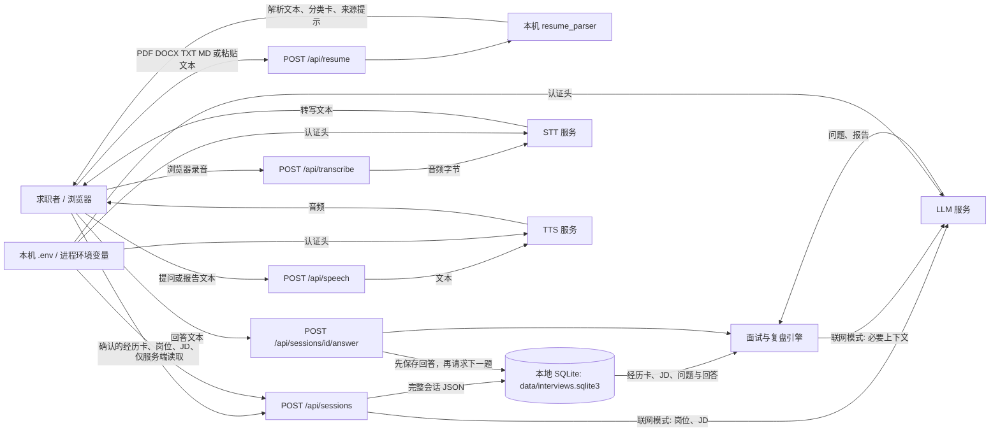

# 第 2 开发日：数据流与首版范围

日期：2026-10-03。对应[逐日开发计划](../开发日计划.md) D02 / M0。此图描述**当前代码的实际行为**；后文“首版范围”是[企业级实施方案](../企业级实施方案.md)的目标，尚未实现的能力不能从当前图中推断出来。

## 当前数据流

规则演示模式不调用 LLM；它只能验证流程，不能提供真实 AI 深挖。无云端 STT 时，前端可尝试浏览器 `SpeechRecognition`，实现与数据处理取决于浏览器；无云端 TTS 时使用系统语音。图中的 STT/TTS 箭头只适用于配置对应服务的情况。当前 `assistant` 是面试官，`user` 是求职者；简历里的第一人称属于求职者。

| 数据 | 进入系统与使用方式 | 当前留存 / 离开边界 |
| --- | --- | --- |
| 简历原件 | 前端将文件 Base64 放入 `POST /api/resume`；本机解析 PDF/DOCX/TXT/MD | 原件不写入会话数据库；请求和前端内存中短暂存在。解析后的全文与卡片返回浏览器。下载、浏览器缓存及服务商无关边界不由此保证 |
| 经历卡、岗位、JD | 用户在浏览器核对卡片后，以 JSON 提交 `/api/sessions`；规则或模型据此生成问题 | 会话整体写入本地 SQLite。联网模式中岗位/JD 用于岗位分析，经历卡/JD 会用于问题与复盘生成；当前每轮生成仍携带完整卡片分类 |
| 答案与问题 | `/answer` 先把求职者回答写入 SQLite，再生成下一题；`/report` 读取整场对话 | 问答与报告存于会话 JSON，可在历史页读取或导出。联网模式把相关对话发给 LLM；具体供应商侧留存须按其条款核查 |
| 录音与转写 | 浏览器 `MediaRecorder` 录音；`/api/transcribe` 把音频交给已配置的 STT；浏览器识别则绕开该 API | 云端录音可在当前页面下载/重试；当前服务端不把音频写入 SQLite，转写文本在提交答案后入库。浏览器刷新会失去未提交录音 |
| 朗读文本与音频 | 浏览器将问题或复盘摘要传给 `/api/speech`，服务端向 TTS 请求音频；否则使用系统朗读 | 合成音频返回浏览器播放，当前不写入会话库；TTS 服务会收到待朗读文本 |
| 密钥与配置 | `app.py` 启动时读取项目 `.env`，环境变量优先；`ai_provider.py` 组装服务端认证头 | `/api/config` 仅返回配置状态及缺失字段名，不返回密钥。密钥随服务端请求进入指定供应商；不应写入前端或仓库 |
| 导出与删除 | `/export` 从 SQLite 生成 Markdown/JSON 交浏览器下载；`DELETE /sessions/{id}` 删除该行 | 用户已下载的文件、浏览器保存的内容和供应商侧留存不随本地删除而消失；当前没有跨服务删除工作流 |

## 信任边界与当前缺口

1. 浏览器到本地 FastAPI：目前有 `Origin` / `Sec-Fetch-Site` 跨站限制，但**没有登录、用户归属或资源授权**。知道会话 ID 的同一服务使用者可以访问对应会话。共享部署的入口必须等 E04/E05 完成。
2. 本地服务到供应商：LLM/STT/TTS 通过 `ai_provider.py` 的 URL 与密钥调用。页面显示“已配置”只验证字段齐全，不代表接口、地域、余额、语音格式或实际质量可用。真实联调归 D04。
3. 本地持久化：SQLite 当前将整场会话作为一个 JSON 保存，没有用户 ID、历史分页或独立消息表。M1 的 E03/E05/E06 负责结构化存储和迁移；现有本机数据库不能自动分配给新注册用户。
4. 请求中的外部调用：当前答题先保存，再同步等待模型；报告也同步生成。网络断开、重启和重复调用的端到端恢复仍需 M2 的持久任务、幂等与 Outbox。
5. 浏览器到用户设备：音频下载和 Markdown/JSON 导出会离开应用控制；未来用户删除只保证应用受控存储按规则处理，不承诺撤销已下载副本。

## 首版范围与非目标

按照实施方案第 1、3、9 节，目标首版为**邀请制多用户 SaaS**。用户已在 D02 确认按此范围推进；具体用户量、部署地区和数据留存承诺留待 M0 退出评审确定。M1 前继续只供本机单用户使用。

| 首版必须交付 | 验收方向 |
| --- | --- |
| 登录、资源归属、导出/删除授权 | 两名用户不能互读、互改、互导出、互删资料；任务与文件同样受控 |
| 简历版本、来源证据卡、任意岗位/JD 与映射 | 保留原文来源和确认状态；项目、实习、学历、技能可区分，岗位不限三个模板 |
| 可靠的文字面试、暂停/结束、刷新恢复 | 已确认答案先持久化；重复提交不重复落库，过时生成不污染已结束会话 |
| 轮流语音录制、转写确认、提问/总结朗读 | 权限拒绝、格式失败、识别失败有清晰状态和文字退路；不宣称实时打断 |
| 证据可追溯的复盘、重答、导出与删除 | 每条反馈对应回答与岗位要求；无证据时说明未考察或证据不足 |
| 用量、任务、故障及最小运营能力 | 可解释单场成本和失败；运营页面默认不浏览用户正文；恢复演练可重复 |

| 本轮 60 开发日不交付 | 再考虑的条件 |
| --- | --- |
| 实时双工语音、自动接话、自然打断 | 轮流语音实测后确认价值，另定延迟、打断和成本指标 |
| OCR、长资料 RAG / 向量检索 | 扫描简历或长资料成为主要输入，且检索有可测收益 |
| 组织/导师协作、企业 SSO、私有部署 | 出现明确客户、角色矩阵与交付环境 |
| 支付、套餐、自动招聘筛选和录用决策 | 成本、需求、人工监督与单独验收明确后另立项目 |

## D02 验收记录

代码对照：`app.py` 的解析、会话、答题、报告、导出与语音接口；`resume_parser.py` 的文件提取；`engine.py` 的规则/联网分支与角色约束；`ai_provider.py` 的供应商调用；`static/app.js` 的浏览器录音与临时状态。上述数据流和边界均可追溯到这些入口。

- [x] 六类数据（简历、JD、答案、音频、密钥、供应商）的来源、处理和去向已画出，并与当前代码对照。
- [x] 当前能力、首版必须交付和非目标已分开；已记录不得共享部署的阻断边界。
- [x] PyCharm 项目配置目录已排除 Git，并纳入基线检查。
- [x] 本地自动化回归与隔离环境烟测通过，结果如下。
- [x] 用户确认邀请制多用户 SaaS 范围，以及账号隔离、文字面试、轮流语音的实施顺序。
- [ ] 部署地区、用户量和数据留存承诺在 M0 退出评审确定；本日未擅自设定。

| 验收项 | 执行方式 | D02 结果 |
| --- | --- | --- |
| 现有回归 | `python -m unittest discover -s tests -v` | 30 项通过 |
| 无密钥完整规则流程 | `python scripts/baseline_check.py` | 干净环境启动、首页、解析、规则面试、复盘、导出、删除全部通过 |
| PyCharm 配置排除 | `git check-ignore -v .idea/workspace.xml` | 命中 `.gitignore` 中的 `.idea/` 规则 |
| 问题处理 | 对照[开发问题记录](开发问题记录.md) | 本日文档与 Git 忽略问题已解决；身份授权和真实服务联调仍按阶段计划推进 |

本日没有真实 API 请求或浏览器麦克风测试。上述通过项只验证当前原型未因 D02 改动而退化；不代表首版 SaaS 功能已经实现。
