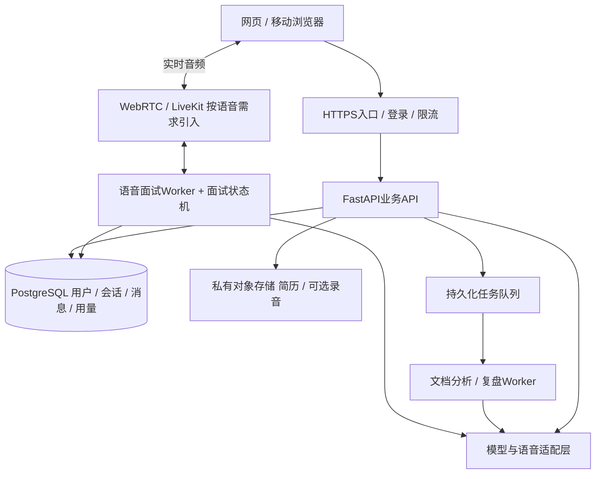

# InterviewDrill：从个人原型到多人产品的迭代路线图

日期：2026-10-02。本文为建议计划，不代表以下能力已实现。工期按1名开发者、持续投入、使用现成模型和语音服务粗估；各阶段以验收结果而非日历强行推进。

## 1. 产品主线

核心承诺：用户上传真实简历和任意岗位JD，完成语音面试，得到有原话依据的反馈，再针对薄弱点重练。

系统支持任意岗位；模型质量无法仅凭支持自由输入而得到保证。先用技术、产品、运营、数据分析等差异明显的岗位验证通用机制，逐步扩大已验证范围。岗位模板可调整关注点，不能替代本次JD或成为白名单。

核心价值衡量：每周完成“面试 → 查看复盘 → 至少一次薄弱题重答”的用户数。注册数和累计问答数只作为辅助指标。

## 2. 当前基线

已有：本地网页、简历文本提取、用户确认经历片段、任意岗位与JD输入、面试状态机、规则演示及模型适配接口、语音入口、历史和导出。已通过7项后端测试及非技术岗位的浏览器流程测试。

尚缺：真实模型和音频端到端联调、AI语义抽取与要求匹配、自适应追问终止、账号和数据隔离、服务端可靠任务、运营指标、成本台账。当前单个会话以JSON整体存储；没有用户归属，不能直接开放给多人共用。

## 3. 分阶段交付

| 阶段 | 建议工作量 | 对象与试验规模 | 本阶段结果 |
| --- | --- | --- | --- |
| V0.2 面试质量 | 1-2周 | 本人及3-5名受邀试用者 | 确认真实AI和语音可用，追问确实针对简历与JD |
| V0.3 封闭内测 | 2-3周 | 20-50名受邀用户；先按5-10场并发压测 | 独立账号、可靠保存、异步报告、额度和成本可控 |
| V0.4 自然语音与训练闭环 | 2-3周 | 依据内测数据逐批扩展 | 降低接话延迟，支持重答和有意义的进步对比 |
| V1.0 公开试用 | 2-4周 | 先设容量上限；按10/25/50场并发逐档压测 | 可监控、可回滚、可恢复，支持可持续的服务方式 |
| V1.x 差异化扩展 | 按验证结果排期 | 已有稳定复访用户 | 专项训练、项目材料检索、可选导师协作 |

人数是招募计划，并发是测试档位，都不是当前容量承诺。总计约8-12周是初始排期，不含供应商不可用、支付接入或复杂实时语音带来的额外工期。

### V0.2：先做到值得练

1. 选定一组中文LLM/STT/TTS服务，验证普通话、英文技术词、长停顿、噪声、超时和重试。记录真实响应时间和每场费用。
2. 把简历段落整理为可编辑的完整经历：项目/实习、角色、动作、结果、来源位置。保留用户确认，不让模型补数字。
3. 建立“JD要求 → 简历证据 → 待验证问题”映射。例如JD要求实验分析，简历写过留存提升，则追问对照组、分母和归因；没有相关经历则问可迁移经验或情境题，不能假设做过。
4. 面试状态增加已覆盖能力、待澄清点、追问深度、剩余时间。模型建议继续/换话题，代码按边界执行。明确不会时可降难度或换题，不机械追问三次。
5. 复盘输出：原话、对应岗位要求、证据缺口、补充事实清单、回答骨架。未考察不扣零分，识别错误不等同能力不足。
6. 增加回答草稿保存、重新连接提示和问题重播；测试结束时自动语音总结。

建议退出门槛：至少20场真实试用，覆盖不少于4类岗位；人工抽检追问中至少80%与具体JD/简历/上轮回答直接相关；参与试用者中至少70%能指出一条有用且具体的反馈；真实引语校验全部通过。指标是产品目标，不是行业标准，小样本要同时看具体问题案例。

### V0.3：可以邀请别人放心使用

产品：账号登录、我的简历、多个目标岗位、历史记录、删除/导出、设备检测、反馈入口、每日或每周练习额度。公共邀请只在本阶段基础能力通过后开放。

工程：

- 所有简历、岗位、会话、录音、报告关联用户ID；身份由服务端登录态确定，每次读取、生成、导出和删除均验证归属。随机会话ID不能代替权限检查。
- 共享部署采用PostgreSQL；将消息从会话JSON拆成独立记录，保留版本号，新增数据库迁移和备份恢复流程。本地版本继续SQLite，不要求个人安装数据库服务。
- 报告和文件分析改为持久化后台任务。先提交任务再返回任务ID，页面轮询或订阅进度。进程崩溃后可以重新领取任务。
- 请求使用幂等键；模型调用、生成结果和费用按请求ID关联，防止重试重复生成或重复扣额度。
- 对文件大小、并发面试数、模型请求频率、单场时长设置限制；实时问答优先于后台报告，避免长报告挤占语音调用配额。
- 文件与可选录音用私有对象存储；按需签名访问，定义保存时间。默认尽量只保留转录；质量调研使用原始录音须单独选择。
- 密钥由服务器统一管理，明确展示云端处理范围。诊断日志不默认写入完整简历和回答。备份中的数据删除与过期策略明确记录。
- 新增跨用户访问测试、故障恢复测试、上传异常测试和模型额度耗尽测试。

建议退出门槛：在预设5-10场并发和供应商可用条件下，面试核心请求成功率≥99%；无故障注入时，系统故障导致的中断率<5%；跨用户读写/导出测试全部拒绝越权；备份能恢复；每场能查到模型、语音和重试用量。测试窗口、样本量及供应商故障另行列出，不用综合成功率掩盖问题。

### V0.4：语音像面试，复盘能训练

- 流式识别、字幕、语音活动检测、说完判断、分句语音合成。先减少等待，再实现插话。暂停、取消任务、停止音频队列和历史截断必须一致。
- 提供“标准面试”和“辅导练习”：前者结束后点评，后者允许一题后给提示、重答；避免训练模式干扰正式模拟的真实性。
- 复盘页一键重答最弱的3题，并加入针对同一能力的新问题，验证是否掌握而非背下原题。
- 同岗位、同难度、同评分版本下比较进步；跨岗位不直接比较总分。模型或评分标准升级后保留版本，必要时重新评价旧样本。
- 根据内测失败样本建立人工标注集。评估范围包括追问相关性、事实约束、重复率、反馈可操作性、未考察处理和语音错字容忍。

建议目标：标准网络环境下，从说完到听到下一题首段语音的P95≤5秒；打断后P95≤500毫秒停止出声。分别测识别、模型、合成和网络时间，目标是否可达需实测。已看到复盘的用户中，至少30%在7天内完成一次薄弱题重答；先用访谈解释未重答原因。

### V1.0：容量可控的公开试用

- 分批发邀请或排队，展示服务繁忙状态；按实测并发逐档加容量，不按注册人数推算。
- 实时面试Worker与后台报告Worker独立扩容；API尽量无状态，重启期间让在途面试完成或明确恢复。
- 全链路可观察：session_id、turn_id、模型/提示词版本、用量、错误类型、各阶段耗时。设置失败率、延迟、队列积压和费用告警。
- 发布前跑固定质量集和负载测试，少量用户灰度，支持代码与提示词独立回滚。
- 设置按用户和平台总额的消费上限、预算告警和供应商降级。费用异常时限制新面试，优先保护进行中的会话。
- 服务方式先验证按次/按时长套餐或有限额订阅；求职是阶段性需求，按周活跃或单月订阅未必适合所有人。定价依据实测成本与用户反馈，暂不写死金额。
- 若开始收费，需有服务端用量账本、支付回调幂等、失败补偿和账单可解释性；重复回调不重复增加或扣除额度。

建议退出门槛：在声明的目标并发下完成30分钟以上混合负载测试，涵盖正在面试、同时上传、同时生成报告和重连；无串话串数据、无丢失已确认答案、队列可在负载下降后恢复。至少连续两周按同一指标口径观察，真实失败与延迟符合发布目标后再扩大名额。

### V1.x：由用户需求决定扩展

可选方向按数据排序：实习/校招/社招难度校准；技术岗位代码/系统设计专项；产品/运营/销售案例面；导入用户授权的项目文档；针对目标JD输出补证任务；用户主动分享报告给导师。

代码执行需要隔离环境。项目资料检索在材料变长、直接上下文效果不足时才加。导师或机构空间需组织权限和成员隔离，单独排期。保持个人练习定位；自动招聘筛选是另一产品，不作为自然延伸直接上线。

## 4. 架构演进

建议保留模块化单体，先让代码边界清楚，再拆部署单元：

API、状态机和后台任务先在同一代码仓库。任务队列可从数据库任务表起步，在需要成熟调度与多Worker时选一个队列实现，不同时堆多套组件。数据库是事实来源，缓存/队列不是唯一会话存储。

| 变化 | 触发条件 | 决策 |
| --- | --- | --- |
| SQLite → PostgreSQL | 共享托管、多进程并发写入、权限与迁移需求 | 云端版本迁移；本地版本保留SQLite |
| HTTP内生成报告 → 后台任务 | 等待过长、页面关闭丢进度、重启丢任务 | V0.3实现，不用内存后台任务替代可靠队列 |
| 轮流录音 → 实时媒体 | 自动接话、自然打断成为验证需求 | V0.4评估LiveKit/WebRTC，不因注册用户增长单独引入 |
| 单进程 → 多API/Worker实例 | 压测显示延迟、队列或CPU达到设定阈值 | 先区分瓶颈；供应商限额不能靠多开服务器解决 |
| 简历原文 → 向量检索 | 项目文档增多，直接上下文成本或质量恶化 | 先测证据段检索，确有收益再加 |
| 原生JS → React/Vue | 设置、报告、历史、实时状态互相影响且维护困难 | V0.3组件化重构；不把框架更换视为并发优化 |
| 单体 → 微服务/Kubernetes | 独立团队、独立发布、调度需求已有证据 | 暂不列为前几个版本必做项 |

SQLite允许多个读者但同一时刻只有一个写者，官方建议在多服务器或大量并发写入场景考虑客户端/服务器数据库；不能据此推导“超过固定人数必然不能用”。[SQLite适用场景](https://www.sqlite.org/whentouse.html)

LiveKit的Agent Server提供会话调度、任务生命周期和水平扩展能力；它解决语音会话运行问题，业务身份、数据权限、成本控制和面试质量仍由本项目负责。[LiveKit Agent Server](https://docs.livekit.io/agents/server/)

部署方案还应分别处理启动、重启、复制、内存和部署前任务，而不只增加worker数量。[FastAPI部署概念](https://fastapi.tiangolo.com/deployment/concepts/)

## 5. 质量评价与版本管理

建立匿名化评测样本，需要使用真实材料时取得授权。样本按JD、简历、回答构成，每条有人工标签；产品可接受任意岗位，质量报告只声称已测试范围。

初始建议30组JD+简历、120段回答，包括：表达空泛、团队贡献混淆、指标无口径、前后矛盾、不知道、无相关经历、转写错误、长回答、离题、材料中夹带指令。先形成最小集，再随真实失败扩充。

每次模型或提示词变化，评估：与材料相关的追问比例、未经证据支持的主张、重复提问、评分依据、建议可执行性、语音时延和单场成本。使用保留测试集；模型自评只作辅助，不能由生成模型独自证明质量。

存储prompt_version、model_version、rubric_version、resume_version、jd_version和报告版本。原始答案不被“润色答案”覆盖，重答作为新记录保存。

## 6. 多人使用的成本与容量

每场成本 = 简历/JD解析 + LLM准备/追问/复盘 + STT音频时长 + TTS用量 + 媒体传输 + 存储 + 重试 + 基础设施分摊。

同时观察单场平均和P95成本；只算“成功场次”会漏掉失败和重复请求。录音时长与面试总时长不同，按真实供应商计费单位记录。

并发粗估示例：假设高峰每分钟新开2场、平均每场20分钟，则稳定期间约40场同时进行。这只是排队与容量的初始估计，还需测试每场模型请求频率、活跃说话比例、语音连接数、配额、网络和报告峰值。

优化顺序：不重复解析未变的简历/JD；实时只带当前证据和必要上下文；后台报告错峰或排队；经过质量评测后再用较低成本模型处理简单任务；音频按约定时间过期；预留重试预算。用户额度预占与最终结算分开设计，中断或重复请求不重复计费。

## 7. 建议先做的下一个迭代

建议投入前两周只交付以下闭环：

1. 真实LLM/STT/TTS联调，完成一场20分钟面试并记录失败、耗时、费用。
2. 简历经历语义抽取、JD要求映射、用户确认；抽取结果必须能回到来源。
3. 根据回答决定追问或换题，增加不会/跳过/澄清/时间不足的分支。
4. 将复盘反馈绑定岗位要求和原话，提供一键重答。
5. 整理20场试用记录和最小质量集，复盘最常见的5类失败。

通过后再做账号和公开部署。若试用者认为问题泛泛，应先修面试质量；若内容有价值但大量人被语音故障劝退，应优先修语音。两者都稳定后，再依据复访、完成率和成本决定扩大服务规模。
