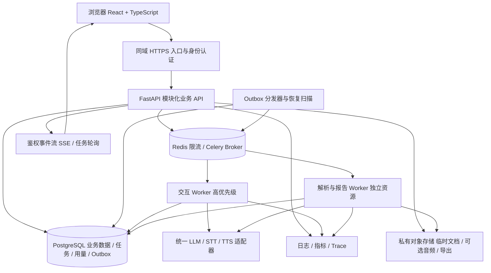

# InterviewDrill：企业级实施方案

编制日期：2026-10-02。基线：当前工作区代码、本地页面、已有架构与路线图，以及本轮实际执行的测试。本文是实施建议，所有未来指标、时间与容量均为待验证目标，不代表现状。

## 1. 核心决策与适用范围

建议将项目建设成「证据驱动的 AI 面试训练平台」：个人完成简历整理、岗位匹配、模拟面试、复盘与重答；后续按需求支持导师或培训机构协作。

企业级的具体含义是：多用户隔离、已确认数据可靠保存、模型质量可评估、故障可恢复、费用可解释、发布可回滚。继续使用 FastAPI 和现有确定性状态机，从模块化单体逐步演进。

本方案默认第一版是邀请制多用户 SaaS。企业组织、SSO、私有部署和收费属于后续条件分支；自动招聘筛选、录用决策不是本次产品范围。若主要用于求职展示，优先完成前四阶段并准备可复现的工程证据，不必先接支付或复杂组织管理。

与现有文档的关系：本方案将《产品迭代路线图》的产品方向转为工程任务、验收门槛和上线顺序；不替代 README 对当前功能的说明。旧路线图中的「7项测试」不是当前基线，本轮为30项。

## 2. 当前项目诊断

### 2.1 已确认的基础

| 方面 | 代码或实测依据 | 评价与保留内容 |
| --- | --- | --- |
| 产品闭环 | README；本地首页；static/index.html | 已有简历、岗位/JD、面试、语音入口、复盘、历史和导出；保留「原文证据」定位 |
| 状态管理 | app.py:66、79、205；engine.py:18 | 已有版本检查、回答先保存、确定性阶段与追问上限；作为后续可靠性基础 |
| 事实约束 | engine.py:49、125、174 | 有 JD 引用、面试官角色检查、报告引语校验；保留并扩展为有版本的评测 |
| 供应商适配 | ai_provider.py:16、51、119 | 有百炼/generic 和 STT/TTS 适配；复用协议处理和现有模拟测试 |
| 文件防护 | resume_parser.py:90；app.py:285 | 已有限制：简历8MB、PDF30页、DOCX解压总量32MB；音频有大小/MIME校验，不从零重做 |
| 测试 | python -m unittest discover -s tests -v | 2026-10-02实测30项通过，涵盖解析、流程、角色和供应商模拟协议 |

本轮浏览器只检查首页与截图，没有向真实供应商发起面试或录音请求。页面显示「已配置」，同时明确提示首次面试才验证连接。上述测试不能证明真实 LLM/STT/TTS 质量、麦克风兼容性、恢复时间或生产并发能力。

### 2.2 按上线阻塞程度排序的缺口

| 优先级 | 现状与证据 | 对业务的影响 | 必须交付的改造 |
| --- | --- | --- | --- |
| P0 | app.py:43 只有 sessions(id, version, body)；58/194/201/259/267 无用户归属条件 | 当前本机信任边界内可用，共享部署后无法隔离用户的读取、导出和删除 | 身份认证、资源所有权、所有入口的授权检查与越权测试 |
| P0 | app.py:49 的 Origin/Sec-Fetch-Site 检查是本地跨站防护 | 不构成用户身份与权限系统 | 保留适当跨站保护，增加可信身份上下文；不能把 CORS 当登录 |
| P0 | 会话整体 JSON 保存在 SQLite；历史列表全量读取、反序列化 | 云端多进程写入、列表增长、用量统计和迁移困难 | PostgreSQL、关系化关键字段、消息独立表、游标分页、迁移脚本 |
| P0 | app.py:97/163/230 请求内等待生成；engine.py:97 和 ai_provider.py:53/121 有长超时 | 断连、进程重启与重复请求难以端到端恢复，长报告占用交互资源 | 持久化任务、幂等、结果查询、重试预算和取消语义 |
| P0 | 已有测试以规则/模拟协议为主，无发布流水线文件 | 模型或提示词升级的真实退化、发布错误难以及时发现 | CI、真实服务小样本验证、人工标注集和发布门禁 |
| P0 | 无服务端用量账本、全链路指标和恢复演练 | 无法回答「为何慢、哪次失败、每场多少钱、重启丢了什么」 | 调用记录、日志脱敏、成本台账、告警与备份恢复 |
| P1 | static/app.js:1/9/17 集中处理 UI、网络与业务状态 | 页面增长后修改耦合；异步时全局禁用按钮；未提交草稿无恢复机制 | React/TypeScript组件化、局部任务状态、草稿与重连恢复 |
| P1 | engine.py:18 按固定上限追问；138 的请求仍带完整简历分类 | 面试深度尚不自适应，每轮上下文与成本可能膨胀 | 能力覆盖状态、引用式上下文、可验证的换题策略 |
| P1 | 语音为录完后识别、整段返回 | 接话等待较长，无法自然打断 | 先分段反馈/流式字幕，再按实测需求引入实时语音 |
| P2 | 无机构协作、SSO、支付、私有部署 | 尚不能销售这些交付能力 | 在明确客户需求与验收标准后单独立项 |

这些是工程改造判断，不是已复现的生产故障清单。当前版本锁能阻止冲突写入，但还需验证并发重试、模型完成时用户结束会话等场景；不能据此声称外部模型只调用一次。

## 3. 第一版范围与产品验收

### 3.1 用户端

1. 登录后仅可访问自己的资料、会话、任务、导出与费用。
2. 简历版本与经历卡保留来源位置、用户确认状态；JD 要求与证据卡建立映射。
3. 面试拥有持久状态，支持文字、轮流语音、暂停、结束、网络恢复；已提交回答与草稿明确区分。
4. 报告按回答与岗位要求给出证据、缺口、下一步练习；支持重答最弱题和查看进步。
5. 显示剩余额度、故障状态、数据处理说明、导出与删除入口。

### 3.2 运营端

第一版提供最小运维页面：查看匿名化任务状态、失败分类、队列、供应商状态与用量；可重试安全任务、限制新会话、切换已验证的模型配置。默认不开放所有用户简历和回答的浏览权限。内容排障访问需要明确授权、受限时效及审计记录。

### 3.3 先后顺序

先完成文字面试的账号隔离与恢复，再把现有轮流语音迁移到同一可靠流程。自然打断、OCR、长资料检索、企业SSO和支付不作为第一批内测的前置条件。界面延续当前深色风格与证据区，优先调整流程、状态提示、键盘可用性及移动端录音。

## 4. 推荐架构与代码边界

### 4.1 目标架构



### 4.2 技术决策

| 层 | 首版选择 | 使用理由与边界 |
| --- | --- | --- |
| 前端 | React + Vite + TypeScript | 适配已出现的资料、会话、音频、报告多状态；建立由 OpenAPI 生成的类型。框架迁移本身不提高后端并发 |
| 后端 | 继续 FastAPI + Pydantic | 把 HTTP、业务规则、存储、供应商分开；复用当前算法和测试 |
| 数据 | PostgreSQL + SQLAlchemy + Alembic | 结构化查询、事务、约束、分页与版本化迁移；用户资料不落 Redis |
| 任务 | Celery + Redis，任务与 Outbox 记录落 PostgreSQL | 使用一个任务框架；Redis传递任务引用，数据库保存权威状态与恢复依据 |
| 文件 | 部署云上的私有对象存储 | 短时授权访问和生命周期管理；原件、音频默认短期处理，长期留存需用户选择 |
| 身份 | 首先接一个成熟 OIDC 身份服务 | 业务后端维护自己的用户ID与权限；Web端优先同域安全会话 Cookie；机构SSO另排期 |
| 交互更新 | 第一阶段任务轮询，随后增加 SSE | 返回任务ID、持久化结果；事件断线后从数据库恢复，不仅保存在进程内 |
| 监控 | OpenTelemetry 接入现成日志/指标/Trace服务 | 同一 request_id/session_id/job_id 串联耗时和失败；避免自行搭建过重观测平台 |
| 部署 | Linux容器、托管数据库、独立API/Worker实例 | 本地Compose复现环境；生产先使用现成容器平台或VM，按容量增加实例 |

不预设微服务、Kubernetes、Kafka或向量库是企业级的必需条件。只有独立发布、调度隔离或检索效果出现可量化需求时再引入。依赖选型实施时锁定已验证的稳定版本，避免仅使用宽版本范围重建生产。

依据：FastAPI 官方把 HTTPS、重启、复制、内存和部署前任务分别列为部署问题；多进程不共享普通内存，因此会话、任务、限流不能依赖单进程变量。参见文末参考[1]。

### 4.3 仓库拆分

建议保留单仓库、同一业务模型，API与Worker是不同运行入口：

```text
frontend/                 页面、组件、类型、录音状态、端到端测试
backend/app/api/          路由、鉴权依赖、请求/响应结构
backend/app/domain/       面试状态机、权限规则、评分契约
backend/app/services/     资料准备、答题、复盘、配额、删除编排
backend/app/repositories/ 数据访问，强制携带所有者上下文
backend/app/providers/    LLM、STT、TTS供应商实现
backend/app/workers/      任务执行、Outbox分发、恢复扫描
backend/app/observability/日志、指标与追踪
backend/migrations/      数据库迁移
prompts/                 有版本的提示词、输出Schema、评分规则
evals/                   脱敏评测集、标注规范、评测结果
tests/                   单元、集成、权限、故障恢复测试
infra/                   容器、环境示例、发布与恢复脚本
docs/                    ADR、接口契约、验收记录、值班手册
```

迁移映射：app.py拆路由/存储/服务；engine.py保留状态机与策略，移出网络调用和提示词；ai_provider.py变为供应商实现；resume_parser.py作为独立解析组件保留；static页面按配置→面试→报告分段替换，避免一次性重写。

## 5. 数据与权限设计

### 5.1 首版核心实体

| 实体 | 核心字段或约束 |
| --- | --- |
| users | 业务用户ID、身份服务subject、状态、创建时间；subject唯一 |
| resumes / resume_versions | owner_id、版本、确认状态、内容哈希；历史会话固定引用某个版本 |
| evidence_cards | resume_version_id、分类、原文、来源页/段落、用户修订、确认时间 |
| job_profiles | owner_id、岗位、JD、JD要求、分析版本；不覆盖历史配置 |
| interview_sessions | owner_id、简历版本、岗位版本、状态、revision、开始/暂停/结束时间、有效时长 |
| messages / turns | session_id、序号、角色、内容、来源、answer_id、client_request_id；顺序与请求唯一约束 |
| reports / practice_attempts | 会话、输入快照、报告版本、rubric版本、引用answer_id、重答记录 |
| jobs / outbox_events | 所有者、输入版本、任务状态、重试次数、deadline、租约、取消状态、输出位置 |
| model_calls / usage_ledger | request_id、attempt_id、任务、供应商/模型/提示词版本、实际用量、结算状态、价格版本 |
| files / audit_events | 所有者、私有对象key、保留截止时间；主体、操作、对象、结果与请求ID |

使用外键、唯一索引和事务维护关键一致性。灵活的模型结构可放JSONB，但状态、归属、时间、幂等键、消息顺序、账本金额/用量应可独立查询约束。账本使用精确数值或整数最小计量单位。

### 5.2 授权规则

- 从已认证身份得到 owner_id，不信任前端传来的用户ID。列表、详情、写入、导出、任务进度、音频与文件下载全部授权。
- 登录解决「你是谁」，资源归属解决「能看哪条数据」，运营权限解决「能执行什么管理操作」；分层实现。
- 接入组织版本时新增 organizations/memberships 与资源 tenant_id；服务端验证成员身份。组织管理员不能天然读取所有个人练习记录，分享需明确作用域。
- PostgreSQL RLS作为额外防线；应用数据库角色不能是超级用户、BYPASSRLS角色或默认绕过策略的表所有者。连接池中的用户/组织上下文在事务内设置并重置；Worker也应用相同边界。参见参考[2]。
- Cookie会话设置Secure、HttpOnly与合适的SameSite，写操作增加CSRF校验；信任代理配置与跨站策略单独测试。
- 文件签名地址短时有效；删除时阻止新的访问，并处理已有短时地址在到期前的暴露窗口。

### 5.3 SQLite迁移路线

1. 在受控环境备份；导出全部会话，统计会话数、消息数、报告条目数与状态分布。
2. 为原本无归属的数据指定明确的迁移所有者；禁止自动将历史资料暴露给新注册用户。
3. 用离线导入脚本拆分实体，保留原session_id、message_id、时间和引用；增加schema_version。
4. 核对计数、内容摘要/哈希、报告引用和完整导出；异常记录单独隔离，不能静默忽略。
5. 首次共享部署使用短暂停写切换，避免不必要的双写；导入脚本重复运行不重复生成数据。
6. 切换后新数据以PostgreSQL为准。应用回滚保持向后兼容；不能直接切回过时SQLite而丢掉切换后的写入。

## 6. 可靠任务与会话一致性

### 6.1 一次答题的目标流程

1. 客户端提交 answer + session_revision + client_request_id。
2. API校验身份、所有权、状态、版本和额度；在一个事务中保存答案、生成任务、写Outbox事件，并完成额度预占。
3. 返回202和task_id；用户立即看到「回答已保存」，不需等待下一题才知道是否成功。
4. Outbox分发器投递任务；Worker领取后记录租约、attempt_id并校验任务仍可执行。交互任务与报告任务分开配置并发和配额。
5. 调用供应商时设置请求超时、任务总deadline、重试预算；记录未知结果与实际用量。
6. 写回问题时同时验证任务状态、会话状态和输入revision；用户已结束/删除会话或任务过期时拒绝过时结果，避免再追加问题或播放声音。
7. 持久化结果后通过SSE通知或轮询读取；客户端按事件序号去重，刷新也能恢复状态。

### 6.2 必须实现的边界

- 同一用户、同一动作、同一幂等键返回同一结果；相同幂等键配不同请求体应拒绝。
- 数据库任务状态为权威，Redis丢消息可由Outbox/超时扫描重新投递；不能只设置Redis持久化就认为任务绝不丢失。
- Worker崩溃通过租约超时恢复；任务重投递可以重复执行，持久化结果和本平台扣额度必须幂等。
- 外部供应商未提供幂等接口时，不承诺模型请求或供应商计费「恰好一次」。区分调用尝试、有效结果和用户结算；超时结果未知时先对账/恢复，再按预算决定重试。
- 退避重试只针对可恢复错误，设置最大次数、总时限和随机抖动；鉴权失败等不可恢复错误直接展示可操作原因。
- 用户结束会话时立即阻止新问题写回并停止本地播放，向可取消的上游发送取消；已产生的供应商费用仍记录，不假装网络断开能撤销调用。
- 解析、复盘等重任务必须可追踪和恢复；不使用仅在API内存里的后台函数承担可靠交付。Celery官方也要求按重复执行的语义设计任务，参见参考[3]。

建议版本化接口：POST /api/v1/sessions、POST /sessions/{id}/answers、POST /sessions/{id}/reports、GET /tasks/{id}、GET /sessions/{id}/events，以及明确的 pause/resume/end 命令。所有任务查询和事件订阅仍需验证所有权。

## 7. AI与语音的产品质量工程

### 7.1 建立可审计的证据链

面试上下文按「JD要求 → 简历版本/证据卡 → 本轮问题 → 用户回答 → 报告引语 → 重答任务」串联。每次生成保存模型、提示词、Schema、评分规则和输入快照的版本。

保留现有面试官角色检查与引语匹配，但不要把字面匹配等同于评价正确：引语可以真实，结论仍可能不成立。新增结构化输出校验、岗位相关性审核、未考察/证据不足/null语义、前后矛盾和越界输出评测。评分只作为训练反馈。

### 7.2 改进追问策略

1. 状态机记录已覆盖能力、待核实主张、追问深度、重复信息和剩余时间。
2. 模型只返回受限建议：继续追问、澄清、换题、降低难度或结束；业务代码裁决是否允许。
3. 用户明确不会、拒答或信息充分时可以换题，不机械用完三次追问。
4. 上下文优先使用当前证据卡、岗位要求、必要近期回答与可回查摘要；当前完整简历每轮发送的做法作为优化基线。
5. 先评估精确证据ID检索与摘要效果；只有加入大量项目资料且检索有明显收益时才增加向量检索。
6. 供应商降级为规则问题时明确标识模式，记录降级率；不能把规则兜底计成真实AI调用成功。

### 7.3 评测集与发布门禁

- 首批建立至少100条脱敏、获准使用的问答/复盘样本，覆盖至少4类岗位及不同经历完整度；按简历/JD案例分组拆分调试集与冻结验收集，避免同一案例泄漏。
- 收集正常答案、含糊贡献、缺数字口径、回答矛盾、无法回答、语音误识别、诱导代答和提示注入等场景。
- 样本含人工标签：相关性、证据支持、重复程度、可执行反馈、角色正确性；抽样双人标注并记录分歧。
- 发布报告列出每类岗位样本量、分子/分母、失败案例，不能只报总体平均。
- 提示词、模型、评分规则每次变更运行同一验收集；关键错误阻断发布，较旧版本可回滚。大模型自动裁判仅辅助筛查，不能替代人工评审。
- 首轮真实试用目标为至少20场、覆盖4类岗位，分别记录LLM/STT/TTS耗时、错误与真实费用。使用真实API的测试独立于每次提交的模拟测试。

### 7.4 语音分级交付

第一版先保持轮流语音：录音 → 转写确认 → 提交 → 下一题播放。把语音失败、重试、权限拒绝、音频格式、设备切换和浏览器刷新恢复做清楚。

改进顺序：分阶段状态提示、上传/识别进度、分句TTS、验证后的流式字幕，再评估自动接话/自然打断。确有需求时单独增加WebRTC/LiveKit运行路径，不能仅给现有HTTP接口换个传输协议就宣称实现自然对话。

打断验收必须覆盖：停止当前播放、取消或作废在途生成、清空待播队列、准确记录实际播出内容、避免把未播放文本当作用户听到过的问题。完整实时语音不包含在下面12周基准排期中。

## 8. 运维、数据生命周期与成本

### 8.1 从第一阶段开始积累观测数据

使用OpenTelemetry的Trace、Metrics、Logs关联一次请求的路径、指标和事件，参见参考[4]。

记录request_id、session_id、turn_id、job_id、attempt_id、模型/提示词版本、错误类别、供应商请求ID、排队与执行时间。日志默认不记录简历全文、回答全文、录音、访问令牌或密钥；调试内容采集需要授权、短保留时间与可审计访问。

五组看板：

1. 产品：开始率、完成率、复盘查看率、薄弱题重答率；区分主动退出与系统中断。
2. 体验：答题保存、下一题文本、STT、TTS、完整语音接话的P50/P95/P99。
3. 稳定性：有效请求成功率、真实模型失败率、降级率、任务超时、队列等待、数据库资源。
4. 质量：引用校验失败、角色错位、人工相关性、同一问题重复率。
5. 成本：单场平均/P95成本、失败重试成本、供应商额度、用户/组织预占与结算。

报警要有动作：如交互队列持续等待先限制新会话，保护进行中的面试；供应商限额告警不能靠无限增加Worker解决。阈值在第一周基线后配置，报警包含负责人、诊断链接和处置手册。

### 8.2 部署与交付

- dev/staging/prod独立配置、数据库和密钥；身份服务回调地址与供应商地区分别核对。
- 先提交版本基线、锁定依赖、统一格式和类型检查；CI运行现有30项测试以及新增集成测试，扫描依赖与意外密钥，构建可追溯镜像。
- 预发布环境执行数据库迁移、权限测试、端到端流程与模型评测；数据库迁移由单独步骤执行，不让所有API实例同时改表。
- 首先灰度少量受邀用户，再分批放量；应用、提示词、模型配置可独立回滚。数据库采用先扩展后收缩的兼容变更，不能把代码回滚当作自动撤销数据库变更。
- 提供存活与就绪检查、优雅停止和任务租约交接；身份、数据库故障要有清晰用户状态。供应商短暂故障不应直接让全部普通API失去就绪状态。
- 生产至少有经验证的备份、恢复入口和值班负责人；需要持续可用时再按目标配置多实例和数据库高可用。单机Compose是开发/受限内测部署方式，不应据此宣称高可用。

### 8.3 文件与隐私生命周期

维持当前最小留存原则。异步解析若需要暂存原件，使用私有临时对象并约定自动清理时间；录音默认不长期保存，用户授权的质量采样另设有效期。转录、报告和导出分别配置保留与删除规则。

删除工作流覆盖数据库、对象、缓存、待执行任务、临时导出；正在执行的任务不能在删除后重新写回。备份按约定到期，恢复备份后重新执行删除清单，避免已删记录恢复可见。审计记录保留必要事件，不复制已删除的正文。

上传保留现有8MB/PDF30页/DOCX32MB解压限额，再增加网关请求体上限、内容类型检查、解析CPU/内存/时限隔离，以及短时文件清理。权限与资源消耗限制都要覆盖下载、导出和任务查询。

上线前由产品与部署负责人确认服务地区、用户范围、供应商数据处理条款、保留时长和删除承诺；有行业或客户合规要求时另设审查任务。技术方案完成不等于合规审查完成。

### 8.4 成本计算与控制

不预设供应商单价或云资源费用。本项目应先测真实用量，再从当时的账号/合同价格填入版本化价格表。

每场可归属成本 = 各次LLM输入/输出计费量×相应单价 + STT实际计费量×单价 + TTS实际计费量×单价 + 文件/传输费用 + 失败与重试费用。固定基础设施费用另行列示，再按声明的活跃/完成场次口径分摊；未完成场次的费用不能消失。

用量账本区分实际供应商成本与对用户收取/消耗的额度：预占 → 执行 → 结算/释放/待对账。重复请求不重复扣平台额度；供应商未知结果不能直接写成零成本。

限制按用户、组织、平台和供应商模型四层设置：日预算、活跃会话数、请求速率、上下文长度、报告重试数。预算临界时预留在途任务开销并暂停新增高成本任务。自动切模型须先通过质量验收，不以省钱为由静默降低报告可信度。

## 9. 12周实施里程碑

资源假设：2名全职开发者（一名偏后端/AI，一名偏前端/全栈），约0.5人力测试与产品验收，约0.2人力运维支持；复用现成身份、数据库和模型服务。12周是规划估算，不是固定交期。单人全职建议按16–24周初估并缩小并行工作范围；兼职另估。

| 阶段 | 时间 | 主责 | 交付物 | 退出门槛 |
| --- | --- | --- | --- | --- |
| M0 基线与边界 | 第1周 | 后端+产品 | 当前流程记录、真实API小样本、数据流、评测种子、需求范围与ADR | 能说明哪类岗位有用、真实调用是否可用、耗时/用量怎么记录；不把配置状态当联调通过 |
| M1 工程底座与身份 | 第2–3周 | 后端；前端配合 | 模块化目录、依赖锁、CI、PostgreSQL迁移、登录与资源授权、分页 | 新环境可复现；30项原测试及新增权限测试通过；两用户不能互读/改/导出/删除 |
| M2 可靠面试任务 | 第4–5周 | 后端+测试 | 答题事务、Outbox、Celery、独立Worker、任务查询、幂等/取消/额度预占 | 重复提交不重复写答案或扣平台额度；刷新/断连/重启可恢复；过时生成不能污染结束后的会话 |
| M3 用户体验与训练质量 | 第6–7周 | 前端+AI负责人 | 组件化页面、草稿与重连、现有语音迁移、证据映射、自适应换题、复盘重答、冻结评测集 | 完整流程通过；证据引用可追溯；真实20场试用完成并有失败记录；核心质量门禁通过 |
| M4 可运营的预发布 | 第8–9周 | 后端+运维 | 用量账本、最小管理页、看板/告警、文件生命周期、容器发布、备份与恢复手册 | 一次真实恢复和回滚演练完成；可追踪到单次失败/费用；告警有人处理 |
| M5 受限试点与放量 | 第10–12周 | 全员 | 20–50名邀请用户、10/25/50并发档位测试、故障演练、缺陷清单、上线记录 | 达到已声明档位的指标；至少连续两周观察；无未关闭的权限/数据丢失/重复结算阻断问题 |

依赖顺序：权限与数据约束先于多用户开放；可靠任务先于多实例扩容；用量观测先于套餐定价；质量评测先于模型降级；恢复演练先于对外承诺。

前端设计和评测样本整理可在M1/M2并行；最终接入依赖稳定接口。若M0发现追问普遍无价值，先修产品质量再投入公开放量。第12周尚未通过门槛则延长内测，不按日历强行发布。

## 10. 验收指标与验证方法

所有数值为建议初始目标；第1周记录真实基线、供应商配额与测试条件后确认。需要调整时记录原因和目标版本，不能在未解释的情况下放宽以通过验收。

| 维度 | 初始验收目标 | 如何验证/边界 |
| --- | --- | --- |
| 权限 | 跨用户和组织越权测试100%拒绝 | 覆盖列表、详情、改写、导出、删除、任务、事件、私有文件；不能只测正常UI路径 |
| 数据可靠性 | API/Worker重启与重投递测试中，已确认答案零丢失、零重复落库/平台扣额 | 事务提交后、入队前、供应商响应后、结果落库前分别故障注入；不含整个数据库灾难的RPO承诺 |
| 普通API | 目标负载下P95≤500ms；答题保存确认单独统计 | 从API收到完整请求到持久化确认；不含文件上传、外部模型推理和排队；也记录浏览器端完整耗时 |
| 文字生成 | 提交已接受到下一题文本可见P95≤10秒 | 含排队和真实供应商；失败/超时另报，不能只展示成功请求延迟 |
| 轮流语音 | 点击停止录音到下一题首段可听P95≤15秒 | 明确音频时长、网络、设备与服务地区；包括上传、STT、LLM、TTS，不把用户说话时长算进去 |
| 自然语音后续目标 | 端点检测后首段可听P95≤5秒、打断停止播放P95≤500ms | 是追加实时语音项目的目标，不属于当前能力或12周必达项 |
| 复盘 | 20分钟样例会话报告P95≤60秒 | 固定转录长度范围，含排队；失败保留输入且可重试 |
| 产品闭环 | 正常条件下核心工作流完成率≥99% | 在固定自动化样本中统计；用户主动退出另列，系统/供应商失败和容量拒绝不静默剔除；规则兜底单列 |
| 可用性 | 初始内部月度SLO 99.5% | 用有效请求/关键旅程探测定义，用户可见供应商故障计入；两周试点不能证明整月SLO，更不是对外SLA |
| 模型质量 | 验收样本中角色错误/伪造直接引语为0；人工相关性≥90% | 列出样本量、分子分母与每类岗位；新增错误阻断版本；样本内0错误不代表所有输入绝无错误 |
| 训练价值 | 试用者≥70%能指出一条具体有用反馈 | 至少20场真实试用并结合访谈；重答率持续观察，不用少量好评代替质量验证 |
| 灾难恢复 | 建议RPO≤15分钟，RTO≤60分钟 | 启用并实测相应备份/PITR方案；在新环境恢复并记录实际数据缺口和耗时；与进程重启零丢失区分 |
| 成本 | 所有供应商尝试有用量/未知状态记录，平台扣额可对账 | 覆盖失败、中断、重试与晚到结果；单场平均/P95支出在产品负责人批准预算内 |

### 压测设计

先用可控供应商替身验证自身系统容量，再做有预算上限的真实供应商小流量验证，两组结果分别报告。不能用替身压测声称真实模型支持同等并发。

按10、25、50场活跃会话逐档测试，每档至少30分钟。建议基线脚本包含：每场每60–120秒提交一次回答、20–60秒录音样本、每分钟1次新简历解析和1次报告、少量断线重连；另加集中提交/报告的突发场景。记录随机种子、数据量、机器配置、供应商限额与实际RPS。

「50场正在面试」不等于「50个模型请求同时执行」。设置交互任务最大并发、排队上限和报告资源隔离；只开放已通过测试且留有余量的档位。负载下降后队列应恢复，不允许无限积压。

### 故障演练清单

必须覆盖双标签同答、重复提交、API重启、Worker崩溃、Redis断开、数据库短暂不可用、供应商超时/429/鉴权失败、报告缺字段/假引语、音频失败、用户结束后模型晚到、删除后任务晚到、导出链接过期与备份恢复。每项有可检查的业务不变量和恢复步骤。

## 11. 第一批可直接进入任务系统的工作

以下按依赖顺序执行；前两周目标是完成E01–E06的主体并启动E07/E08，不要求十项全部挤进同一迭代。

| ID / 优先级 | 任务 | 依赖 | 验收证据 |
| --- | --- | --- | --- |
| E01 / P0 | 保存当前版本基线、确认忽略本地密钥/数据；记录30项测试与首页 | 无 | 干净环境启动记录、测试输出、当前功能边界；不把本地私密数据提交仓库 |
| E02 / P0 | 建立模块目录、依赖锁、CI与配置验证 | E01 | 新环境一条文档化命令运行测试；缺必要配置时报明确错误 |
| E03 / P0 | 定义用户/会话/消息模型与Alembic迁移 | E02 | 新库初始化和迁移重复运行安全，唯一键/外键测试通过 |
| E04 / P0 | 接一个OIDC登录，业务用户映射、安全会话与退出 | E02 | 登录、过期、退出、禁用用户流程可验证；后端识别可信用户 |
| E05 / P0 | 给所有会话/文件/任务入口加入资源授权 | E03、E04 | A用户拿B的ID不能读取/修改/导出/删除，日志无正文泄漏 |
| E06 / P0 | SQLite导入、历史列表分页、旧会话导出对账 | E03、E05 | 历史数据归属明确，计数/引用一致；大列表不全量解析会话正文 |
| E07 / P0 | 答题事务、幂等键、jobs与Outbox、202任务查询 | E03、E05 | 重复提交只保存一条答案；提交成功后断连仍可找回结果 |
| E08 / P0 | 统一供应商调用指标与真实服务基线 | E02 | 每次调用有耗时/用量/版本；记录真实LLM/STT/TTS成功和失败样本 |
| E09 / P0 | 接Worker、恢复扫描、截止时间/取消/费用结算 | E07、E08 | Worker中断可恢复；晚到结果不污染结束/删除会话；费用不重复结算 |
| E10 / P1 | 前端分步迁移，保留样式，加入草稿/任务状态/重连 | E05、E07 | 文字闭环先通过，再接现有轮流语音；页面刷新不丢已确认答案 |

M1之前不把当前本地服务直接开放给无隔离的多用户。第一阶段的外部体验可通过脱敏样例或由负责人控制的独立会话演示收集反馈。

## 12. 企业客户与规模化的追加条件

| 触发信号 | 新增交付 | 需要单独验收 |
| --- | --- | --- |
| 导师/机构明确需要管理学员 | 组织、成员邀请、分组、训练任务、授权分享、组织额度 | 跨组织隔离、角色矩阵；导师只能查看被明确分享/分配的记录 |
| 客户要求统一身份 | 企业OIDC/SAML等实际IdP对接、账号生命周期、管理审计 | 退出/撤权、生效时限、离职账号处理；不把普通个人登录当SSO交付 |
| 明确购买私有部署 | 安装/升级包、依赖清单、可配置模型网关、备份/监控接入手册 | 在客户目标环境完成安装、升级、恢复；离线模型按硬件与质量另测 |
| 拟开始收费 | 套餐、支付回调、订单、退款/补偿、账单 | 回调幂等、额度并发、对账；价格基于实测成本与客户需求 |
| 活跃并发超过已验证档位 | API/Worker扩容、配额提升、数据库优化 | 重新压测；确认瓶颈是自有服务还是供应商 |
| 长资料导致上下文费用/质量恶化 | 增加带权限过滤的资料检索 | 可量化相关性、召回与成本收益；引用能回查原文 |

上述能力不挤入12周基准；获得真实需求后另估工作量和交付依赖。

## 13. 关键风险与应对

| 风险 | 早期信号 | 应对与负责方 |
| --- | --- | --- |
| 面试内容价值不足 | 人工相关性低、用户说问题泛泛 | AI/产品先修证据映射与策略，暂停新增花哨功能 |
| 供应商延迟/额度不稳定 | 接话P95上升、429、成本异常 | 后端增加全局限流、可解释降级和预占预算，向服务商核实配额 |
| 重构影响已有闭环 | 旧测试或导出对账失败 | 按模块与页面迁移；每阶段保持可运行，不同时重写解析和状态机 |
| 过度建设拖慢验证 | 还没完成真实试用就投入复杂集群 | 产品负责人守住首版范围，按阶段门槛释放后续工作 |
| 小团队无人运维 | 报警无人处理、恢复手册未执行 | 明确值班/故障负责人、降低开放容量；未演练不承诺SLA |
| 日历排期被当作效果承诺 | 临近上线仍有权限或数据一致性问题 | 发布门禁优先；先延期内测，不牺牲隔离与可恢复性 |

## 14. 最终交付与项目展示证据

完成企业级首版时，应能交付：部署中的受限试用站点、版本化代码与构建、架构ADR、数据库迁移/回滚说明、权限矩阵、模型评测报告、真实语音记录的授权摘要、混合压测报告、成本分析、故障演练记录和运行手册。

若用于求职展示，优先准备四个可复现案例：两用户隔离；重复提交与Worker重启恢复；模型/提示词升级前后质量对比；一场面试的耗时与费用追踪。展示真实结果、样本量和限制，而不是声称未测过的高并发或生产规模。

### 已核对的官方参考

- [1] [FastAPI 部署概念](https://fastapi.tiangolo.com/deployment/concepts/)：HTTPS、启动/重启、复制、内存、部署前步骤。
- [2] [PostgreSQL 行级安全策略](https://www.postgresql.org/docs/current/ddl-rowsecurity.html)：策略作用范围、默认拒绝、所有者与BYPASSRLS边界。
- [3] [Celery 任务语义](https://docs.celeryq.dev/en/stable/userguide/tasks.html)：幂等、确认时机、Worker失效与重试；不能把acks_late理解为无条件的恰好一次。
- [4] [OpenTelemetry Signals](https://opentelemetry.io/docs/concepts/signals/)：Trace、Metrics、Logs等观测信号。

参考核对日期：2026-10-02。软件版本、供应商能力/配额/价格应在实际实施和采购时重新核对。
