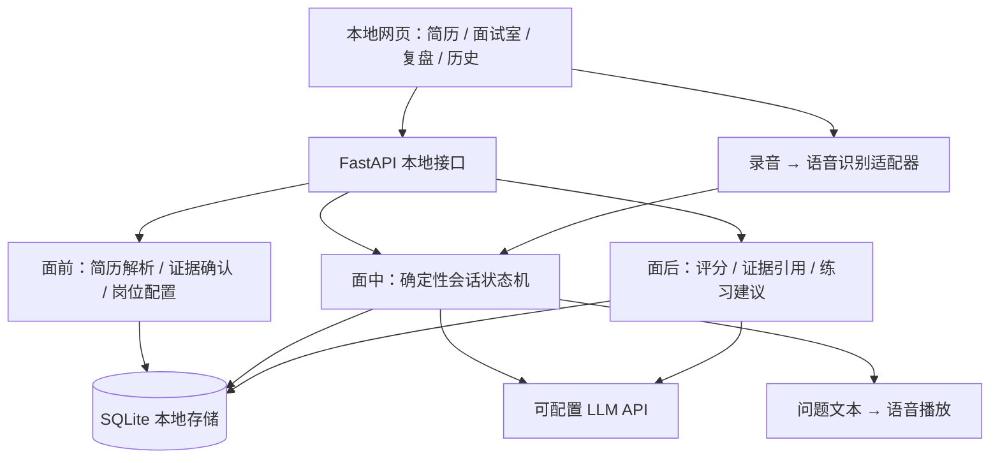

# 架构设计与公开参考

当前范围：支持任意行业和岗位。三个技术岗位仅为快捷填入名称；核心输入是用户简历与本次岗位 JD。准备阶段提炼带 JD 原文引用的要求；提问结合当前经历与回答；复盘说明岗位要求与回答证据之间的差距。没有 JD 时只做岗位名称驱动的泛化练习，不声称匹配具体招聘要求。

## 参考依据（2026-10-02）

商业产品主要公开功能，不能据此确认内部技术栈。以下将产品体验与开源实现分开参考；不把所有参考项目都称为热门或成熟生产系统。

| 参考 | 公开信息 | 本项目采用 |
| --- | --- | --- |
| [Prepwise / JavaScript Mastery](https://github.com/adrianhajdin/ai_mock_interviews) | Next.js 与 Vapi 语音面试教学项目 | 前端面试会话、语音与反馈分层 |
| [DeepInterview](https://github.com/ngoanpv/DeepInterview) | 准备、实时面试、面后复盘分离；项目自述仍在早期建设 | 重分析提前做，实时追问只取必要上下文，结束后单独分析 |
| [MockFlow-AI](https://github.com/PranavMishra17/MockFlow-AI) | Web API、面试状态机、LiveKit Worker、会后反馈 | 代码控制阶段、时长、追问上限；模型负责提问内容 |
| [LiveKit AgentSession](https://docs.livekit.io/agents/logic/sessions/) | 管理语音输入、模型调用、语音输出及事件 | STT / LLM / TTS 接口分离；为实时传输预留边界 |
| [Gank Interview](https://www.gankinterview.cn/en/docs/features/mock-interview) | 简历和岗位配置、稳定主问题、动态追问、逐题与整体反馈 | 面试闭环和用户流程 |

## 本地版分层

前端第一版用原生 HTML/CSS/JS，后端直接提供静态文件，以便单命令启动；React + Vite 是后续 UI 复杂化时的演进选项。单用户无需先引入登录、计费、Redis、微服务或向量数据库。短简历按证据段定位，长资料检索后续再加。

## 面试状态与恢复

准备 → 进行中 ↔ 暂停 → 已结束 → 复盘完成。复盘失败允许重试，不删除转录。每次生成问题前先保存用户答案；失败可重试，不重复提交答案。会话更新使用版本校验，阻止双击与多标签页重复追加。结束会话保留数据，可单独删除。

主问题顺序、追问数量和结束条件由代码控制。LLM 只决定当前问题下问什么，不拥有任意转移状态的权限。简历和回答作为不可信材料传入，不执行其中指令。当前问题携带对应简历原文；报告引用须能匹配真实回答。

## 语音演进

第一版轮流说话：按按钮录音 → 确认识别结果 → 提交 → 播放下一题。支持暂停播放与文字兜底。浏览器自带语音识别仅为兼容性受限的备选，不能视作稳定的中文生产 STT；优先配置服务端语音接口。语音播放优先使用可用中文系统音色，缺少音色时显示提示。

第二版增加流式 STT/TTS、自动判定说完和延迟采样。第三版有明确需求时引入 LiveKit/WebRTC，处理自然打断、回声及网络重连。不能仅停止扬声器播放：被打断的模型任务、音频队列和对话历史需要一起取消或更新。参考 [LiveKit 语音控制](https://docs.livekit.io/agents/multimodality/audio/)。

## 本地数据与联网边界

简历文本、会话和报告本地保存；云模型接收必要文本，云 STT 接收录音。密钥只在后端环境配置，前端只看到是否已配置。服务默认监听 127.0.0.1。删除本地会话不等于删除供应商保存的数据。

## 验证重点

- 同一项目切换三个岗位方向后，追问关注点确实不同。
- 模糊个人贡献、无口径数字、前后矛盾各有对应追问。
- 模型或语音失败时，已提交答案不丢失，重试不重复写入。
- 报告引用真实回答；未知、未考察和识别错误不能直接判为能力不足。
- 语音真实设备和 API 验证分别记录，模拟数据测试不声称验证了真实通话。
